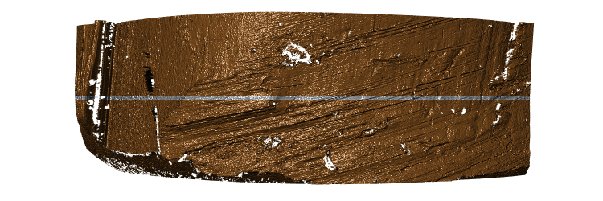
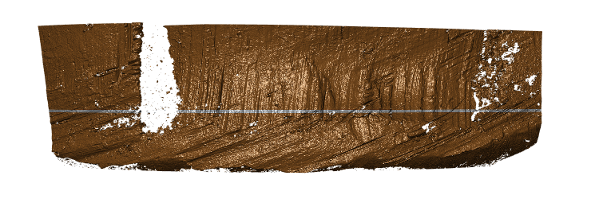
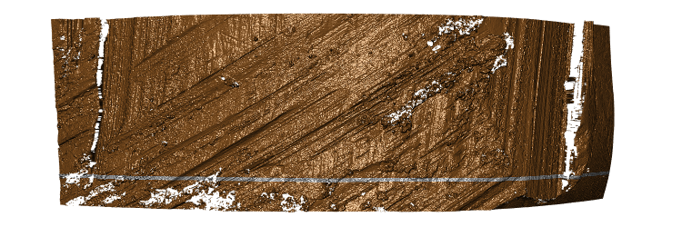
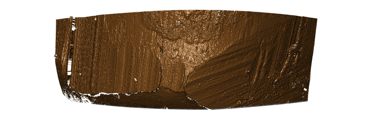
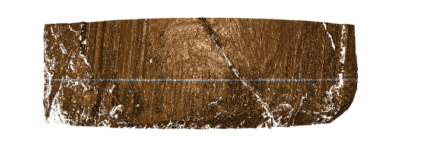

# DIB-Hamby

Data in Brief for the Random Forest based on Hamby sets 173 and 252

## Repository structure

The four main elements to this repository are the four folders: `data`, `images`, `code`, and `writeup`. The contents of each of these folders is described in detail below.

### Images

The `images` folder contains a total of 420 images in png format. These images are renderings from the original topographic scans of land engraved areas from fired bullets. The renderings are overlaid by annotations from the matching procedure. The white lines correspond to the profile used for comparisons. All images are checked (manually) for two kinds problems: problems with the physical bullet, and problems from the automatic matching process.
Problems with the physical bullet (such as tank rash or holes) make the scans unsuitable for automatic comparisons. The corresponding files are moved into the folder `damaged`. 
An unfortunate choice of crosscut creates problems for the further analysis. The corresponding images are moved into the folder `crosscut`. For all of these images, the automatic crosscuts are replaced by a manual choice, which allows us to keep data from these scans in the downstream analysis. 

    ├── images
    │   ├── crosscut
    │   ├── damaged
    │   ├── Hamby173-Br1-B1-L1.png
    .   .
    .   .
    .   .
    │   ├── Hamby173-BrUkn-BX-L6.png
    │   ├── Hamby252-Br1-B1-L1.png
    .   .
    .   .
    .   .
    │   ├── Hamby173-Br1-B1-L1.png

#### Damage to the bullet - some examples

Large scratches across striation marks as seen in images (a)-(d) indicate that the bullet skimmed along the inside of the water tank after exiting the barrel. The deformation seen additionally in (d) indicates that the bullet collided with the inside of the water tank rather than just skimming along it. Image (e) shows a crack running through the land-engraved area. 
All of these issues are unrelated to the firing process, and the corresponding scans should therefore not be used for a comparison. 

|     |     |     |
|:----|:----|:----|
| (a)     |  (b)    |  (c)      | 
| (d)    |  (e)    |

A total of 30 scans was excluded from analysis because of damage.

### Code

There are three R scripts in the code folder:

    ├── code
    │   ├── create-features.R
    │   ├── fitting-randomforest.R
    │   └── publishing-data.R

#### code/create-features.R

**input:**

-   (automatically triggered) download of the x3p files from the [NIST Ballistics Toolmark Database](https://tsapps.nist.gov/NRBTD/Studies/Search)
-   file `data/meta-info.csv` with meta information for each scan, such as (manual) groove locations of each profile, and an identifier with ground truth for all land-to-land comparisons. 

**output:**\
`data/hamby-comparisons.csv`, this file contains features based on pairwise comparisons of striation marks on bullet lands\

#### code/fitting-randomforest.R

**input:**\
\
`data/hamby-comparisons.csv` (as created in code/create-features.R)

**output:**\
\
`data/csafe-isu2.rds` a binary object of a random forest for scoring the similarity of pairs of lands\

#### code/publishing-data.R

**input:**

-   `data/hamby-comparisons.csv`
-   `data/csafe-isu2.rds`

**output:**

This script re-creates all figures in file `writeup/hamby-dib.Rnw`

